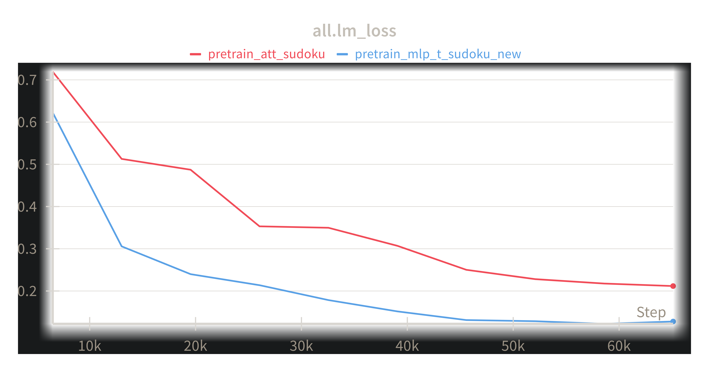
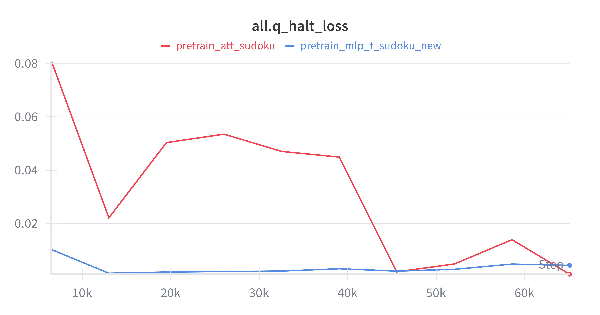
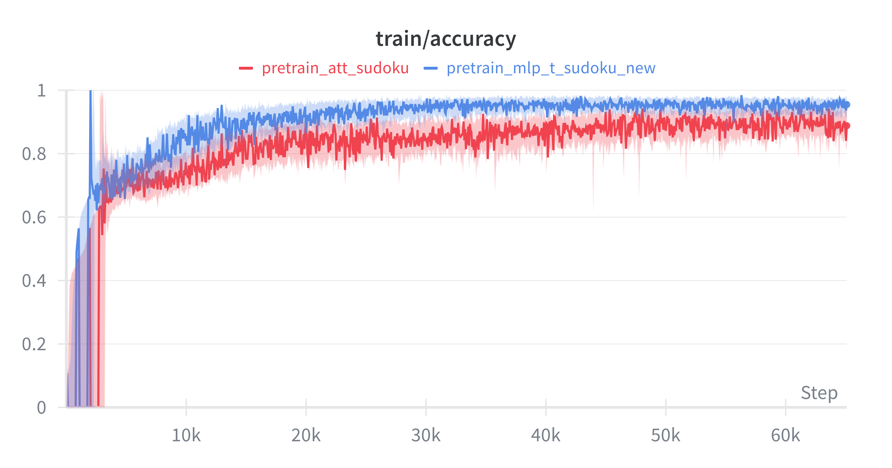
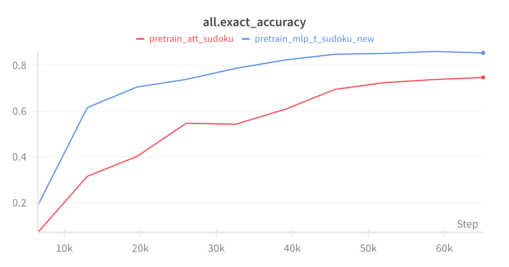

# Reproduction of the paper "Less is More" (TRM) by Alexia Jolicoeur-Martineau
Full paper here: https://arxiv.org/pdf/2510.04871

## Motivation
I'm deeply interested in different architectural approaches instead of the scaling/scaffolding/data curation approaches the big AI labs usually focus on. The results of this paper actually impressed me quite a bit, since they manage to significantly outperform vastly bigger (and more expensive) LLMs, albeit in a narrow domain.
So I decided to give it a try and (partially) reproduce the findings. I found that doing stuff like this is a really fun way to learn :)

## Approach
I went with the Sudoku-Extreme, because it requires little compute while providing an interesting insight into the MLP-mixer vs self-attention mechanisms.
I ran all of it on a single RTX A6000. 

Preparation just like in the original:
```
# Dataset Sudoku-Extreme
python dataset/build_sudoku_dataset.py --output-dir data/sudoku-extreme-1k-aug-1000  --subsample-size 1000 --num-aug 1000  # 1000 examples, 1000 augments
pip install --upgrade pip wheel setuptools
pip install --pre --upgrade torch torchvision torchaudio --index-url https://download.pytorch.org/whl/nightly/cu126 # install torch based on your cuda version
pip install -r requirements.txt # install requirements
pip install --no-cache-dir --no-build-isolation adam-atan2 
wandb login YOUR-LOGIN
```
Actual training runs:
```
python pretrain.py \
arch=trm \
data_paths="[data/sudoku-extreme-1k-aug-1000]" \
evaluators="[]" \
epochs=50000 eval_interval=5000 \
lr=1e-4 puzzle_emb_lr=1e-4 weight_decay=1.0 puzzle_emb_weight_decay=1.0 \
arch.L_layers=2 \
arch.H_cycles=3 arch.L_cycles=6 \
+run_name=${run_name} ema=True

python pretrain.py \
arch=trm \
data_paths="[data/sudoku-extreme-1k-aug-1000]" \
evaluators="[]" \
epochs=50000 eval_interval=5000 \
lr=1e-4 puzzle_emb_lr=1e-4 weight_decay=1.0 puzzle_emb_weight_decay=1.0 \
arch.mlp_t=True arch.pos_encodings=none \
arch.L_layers=2 \
arch.H_cycles=3 arch.L_cycles=6 \
+run_name=${run_name} ema=True
```


## Results
Attention took 17h 47m, MLP 22h 39m. Both converged nicely without any hickups (which is quite rare out of the box for a research publication - solid job on Alexia's part).

Tracked all of it on W&B. Since I had to look up what some of the params actually meant (the naming wasn't quite intuitive in all cases), I'll briefly explain them below, hope it helps:
1. **lm_loss (Language Modeling / Prediction Loss)**:
    Standard Cross-Entropy loss.
    It measures how good the model is at filling in the missing Sudoku cells.
    Intuitively: "Did it guess the number in cell (3,4) correctly?"



2. **q_halt_loss (Halting Loss)**:
   Context: The TRM uses a mechanism inspired by Adaptive Computation Time (ACT). It tries to learn when it has thought enough.
   In her paper, Alexia simplifies the complex Q-learning approach used in previous models (HRM) to a simpler binary classifier.
   The q_halt_loss trains a small "head" on the network that outputs a probability: "Is my current answer correct yet?"
   It is trained using Binary Cross Entropy (BCE) against the ground truth (i.e., if the puzzle is currently solved, the target is 1; otherwise, 0).
   The name q_ is a legacy artifact from the HRM code (which used Q-learning) -> in TRM, it's effectively a "Halting Classifier Loss."



3. **q_halt_accuracy**:
   This measures how good the model is at knowing it is finished.
   High q_halt_accuracy means the model correctly realizes: "I haven't solved this Sudoku yet, I need to recurse more" or "I have solved it, I should stop."


4. **accuracy (Cell-wise Accuracy)**:
   This one tripped me up a little - it's the percentage of individual(!) empty cells filled correctly.
   If a Sudoku has 50 empty cells and the model fills in 45 correctly, the accuracy is 90% (even though the Sudoku-puzzle itself would be considered unsolved/wrong - therefore we need another metric for that). 
   This metric is important, because we need to be able to measure the degree of correctness more finely than "oh we still didn't get a single Sudoku right". This allows us to train those intermediate steps between complete solutions.



5. exact_accuracy (Puzzle-wise Accuracy):
   The percentage of entire puzzles solved perfectly (81/81 cells correct).
   This is the "real" metric that matters for logic puzzles. If we get 1 cell wrong in Sudoku, the solution is invalid, as mentioned above.
   A 85% exact_accuracy means 85 out of 100 puzzles were solved perfectly.




## Findings & explanation:
I was able to reproduce the paper's findings almost exactly, hitting 74,7% with Self-Attention and 85,4% with the MLP-Mixer.

Quick background:
In a standard LLM (like GPT) a "Transformer Block" consists of Attention (mixing information between tokens) followed by an MLP (processing information within a token). They work together.
In the paper/with TRMs, they are testing a radical simplification. They are basically asking: "For the Recursive Step, what is the minimal mixing mechanism we need?"
So they replace the standard Transformer block with either:

    arch.mlp_t=True (The MLP Run): The TRM mixes information across the sequence using a transposed MLP (similar to a MLP-Mixer architecture). So no Self-Attention.

    arch.mlp_t=False (The Attention Run): The TRM uses standard Self-Attention to mix information.

The paper argues that for small, fixed-size grids (like Sudoku 9x9), the MLP-Mixer approach is actually superior (more stable, easier to train). However, for larger or variable-sized grids (like the Maze or ARC tasks), the MLP approach fails, and Attention is required.
So my runs confirm the paper's hypothesis: The MLP version (~85%) beats the Attention version (~75%) on Sudoku.
Since the results align closely with what the paper reports, I'll save myself the compute to do the ARC-runs (it runs for about three days using 4 H-100 GPUs).